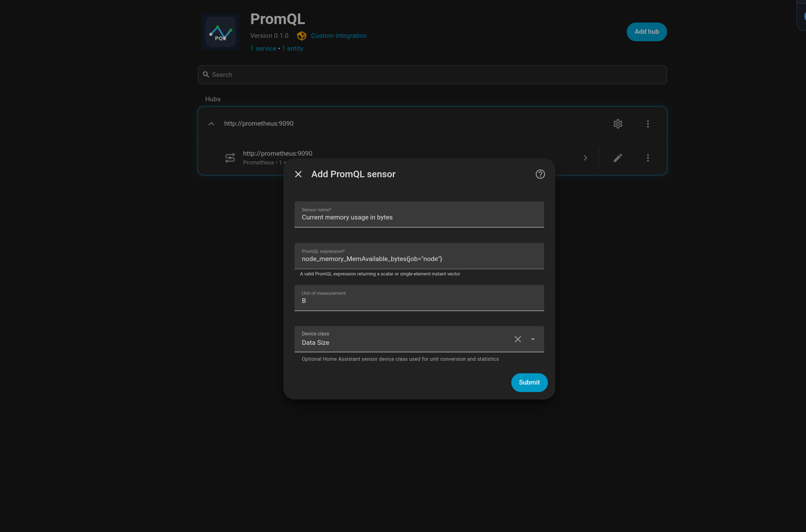
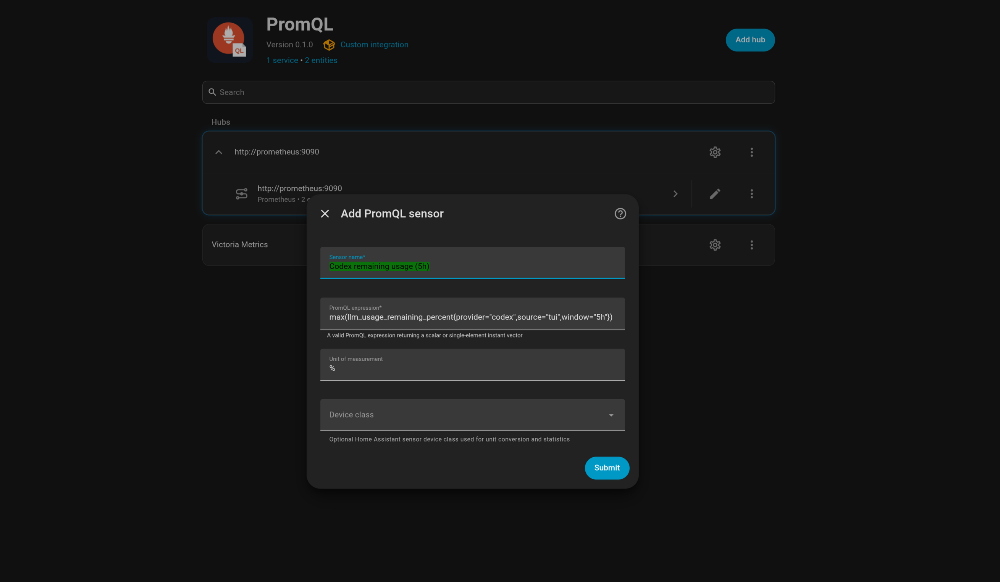
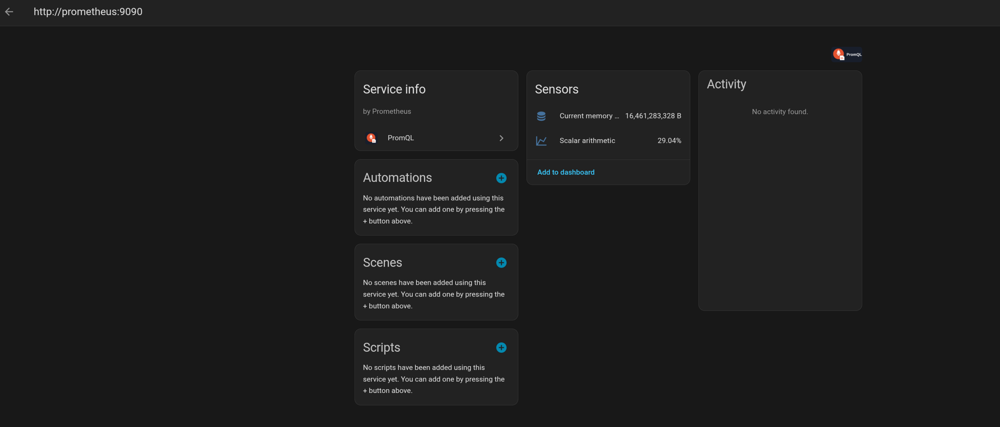
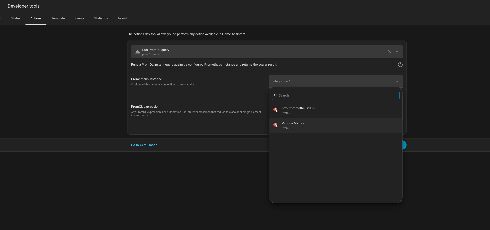

# PromQL Integration for Home Assistant

A Home Assistant custom component that lets you define [PromQL](https://prometheus.io/docs/prometheus/latest/querying/basics/) queries in the UI and expose results as sensors.

## Features

- Configure multiple Prometheus-compatible instances via the Home Assistant UI
- Add any number of PromQL sensors per instance
- Configurable update interval (30 seconds by default, minimum 5 seconds)
- Identical expressions share one request per refresh; disabled sensors are skipped after setup
- At most four queries run concurrently per instance during polling
- Unchanged results avoid unnecessary Home Assistant state updates
- Installable via [HACS](https://hacs.xyz)

## Requirements

- Home Assistant 2026.5 or later
- Python 3.14 or later

## Installation

### HACS (recommended)

1. Add `https://github.com/Ginden/hass-promql` to HACS as a custom repository
2. Install **PromQL** from the integrations list
3. Restart Home Assistant

### Manual

Copy `custom_components/promql/` into your Home Assistant `custom_components/` directory and restart.

## Setup

1. Go to **Settings → Devices & Services → Add Integration** and search for **PromQL**
2. Enter the base URL of your Prometheus server (e.g. `http://prometheus:9090`)
3. Open **Configure** on the PromQL instance and choose **Add PromQL sensor** — each sensor takes a name, a PromQL expression, and optional unit, device class, and state class metadata. Expressions can span multiple lines.
4. Use **Test query** in the same menu to check an expression before saving it. Empty or multi-series results include guidance for producing a sensor value.



Multiple Prometheus-compatible instances can be configured side by side (e.g. Prometheus, VictoriaMetrics, Thanos):



Use **Configure → Edit PromQL sensor** or **Delete PromQL sensor** to manage existing sensors. Dropdowns distinguish sensors with the same name. Editing a sensor keeps its entity ID, and optional units or device classes can be cleared.

Use the instance menu's **Reconfigure** action to update its URL, credentials, or polling interval. Moving a server to a new URL preserves the existing sensors.

Each sensor appears under a service-type device grouped per instance:



A `promql.query` service is also registered, which runs an ad-hoc instant query against a configured instance from Developer Tools or automations:



## Query requirements

Queries must return a **scalar** or a **single-element instant vector**. Multi-series results are not supported and will produce an unavailable sensor.

Empty results, failed requests, and non-finite values (`NaN`, `+Inf`, `-Inf`) also make only the affected sensors unavailable. They recover automatically when a subsequent query returns a finite number.

New sensors default to the `measurement` state class so unitless counts and gauges are treated as numeric history by Home Assistant. Pick `none` to opt out of statistics, or use `total` / `total_increasing` for PromQL expressions that represent totals.

Examples:

```promql
# Current memory usage in bytes
node_memory_MemAvailable_bytes{job="node"}

# Scalar arithmetic
100 - (avg(rate(node_cpu_seconds_total{mode="idle"}[5m])) * 100)
```

## Local development

```bash
docker compose up --build
```

Starts Home Assistant, Prometheus, and node-exporter.

| Service        | URL                   |
|----------------|-----------------------|
| Home Assistant | http://localhost:8123 |

On first run, complete the HA onboarding wizard in the browser (one-time).
State persists in `dev/ha-config/` across restarts.

**Adding a sensor:** Settings → Devices & Services → PromQL → Configure → Add PromQL sensor.
Enter `http://prometheus:9090` as the Prometheus URL — this is the Docker
Compose service hostname, not `localhost` (which would resolve to the HA
container itself). Example queries are in `dev/example-queries.txt`.

To reset: `rm -rf dev/ha-config && mkdir dev/ha-config`

For a standalone self-contained image (no Prometheus bundled):
```bash
docker run -p 8123:8123 $(docker build -q .)
```

## Publishing a version

1. Open [GitHub Actions → Release](https://github.com/Ginden/hass-promql/actions/workflows/release.yml).
2. Click **Run workflow**, select **main**, and enter the new version, for example `0.1.3`.
3. Check **Publish to HACS** and click **Run workflow**.

The workflow validates the version, runs tests, linting, type checks, Hassfest, and HACS validation, then creates the version tag and publishes a GitHub release with generated notes and `promql.zip`. No local commands or extra secrets are needed.

Leave **Publish to HACS** unchecked for a build-only run. The validated ZIP will be downloadable from the run's artifacts; no tag or release is created.

Use a stable `major.minor.patch` version newer than existing release tags; a leading `v` is optional. The version bump is committed in the release tag's history so tagged source downloads match the HACS archive while GitHub and Gitea `main` remain aligned. Release tags live on GitHub.

Publishing a release manually through GitHub's Releases page still triggers archive generation.

## Notes

- `aiohttp` is bundled with Home Assistant — no additional Python dependencies are installed
- HACS distribution requires a public GitHub repository
- Gitea CI uses `.gitea/workflows/ci.yml` for tests, linting, type checks, and Hassfest. External actions use explicit GitHub URLs because the Gitea instance resolves short action names to local repositories.
- GitHub CI uses `.github/workflows/` for tests, Hassfest, HACS validation, and release archives. HACS validation and publishing run on GitHub, where the public distribution repository and its token are available.
